# edX Platform — Business Intelligence Report

**Data source:** edX.org public course catalog · **5,107 courses** · **133 partners**
**Total recent enrollments tracked:** 3,022,568

---

## Executive Summary

This report analyzes the edX online learning marketplace to surface strategic opportunities and risks for platform operators, content partners, and investors. Six high-priority findings emerge from the data:

1. **Data & AI skills are the most in-demand subject on the platform** — with the highest average enrollment per course of any subject area.
2. **Harvard University alone accounts for 47% of all enrollments** — creating dangerous platform-level concentration risk.
3. **89% of courses are introductory or intermediate** — leaving an under-served advanced learner market.
4. **Self-paced courses outperform instructor-paced courses 2:1** in learner adoption.
5. **60% of courses have fewer than 100 enrollments** — revealing a significant long-tail inefficiency problem.
6. **Non-English markets are structurally under-monetized** — Spanish has 804 courses but only 14% of English's average engagement.

---

## Finding 1 — The Real Market Opportunity Is in Data & AI, Not Computer Science

> **Chart:** `02_avg_enrollment_by_subject.png` · `01_catalog_size_by_subject.png`

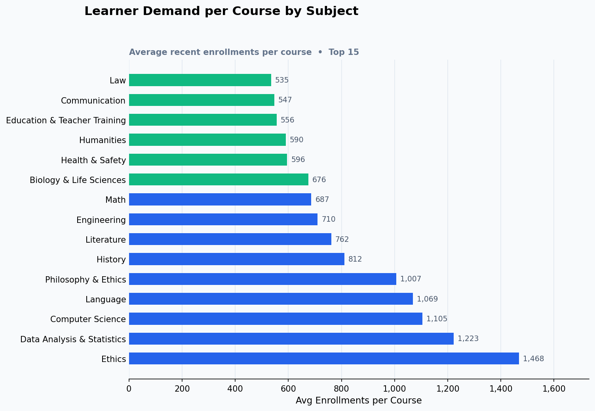

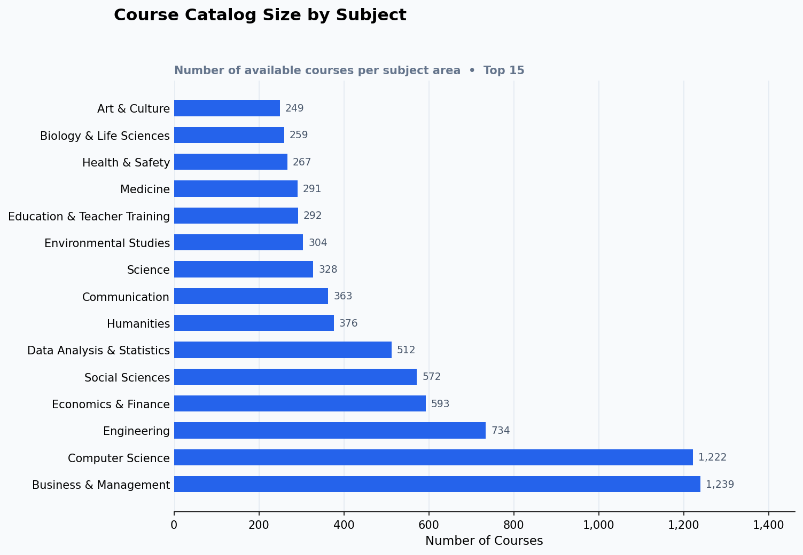

**What the charts show:**
Computer Science has the largest course catalog (1,222 courses) and Business & Management is a close second (1,239). Yet when we measure *average enrollment per course* — the clearest signal of genuine learner demand — **Data Analysis & Statistics leads all subjects at 1,222 average enrollments per course**, followed by Computer Science (1,104) and History (811).

Business & Management, despite being the largest subject by course count, ranks only 9th in average enrollment per course (522). This is a direct signal of **oversupply relative to demand** in that category.

**Why it matters:**
The catalog is built around what is easy to supply (business theory, management frameworks), not what learners are actively seeking (data skills, applied analytics, AI). Partners adding yet another business course face an increasingly competitive market where most courses go under-enrolled.

**Recommended action:**
Prioritize commissioning and promoting Data Analysis, Computer Science, and History content — these subjects have proven learner appetite but haven't saturated their market. Apply a brake to general Business & Management course intake until enrollment performance improves.

---

## Finding 2 — Harvard Captures Half the Platform's Attention

> **Chart:** `03_top_partners_total_enrollment.png` · `04_partner_efficiency.png`

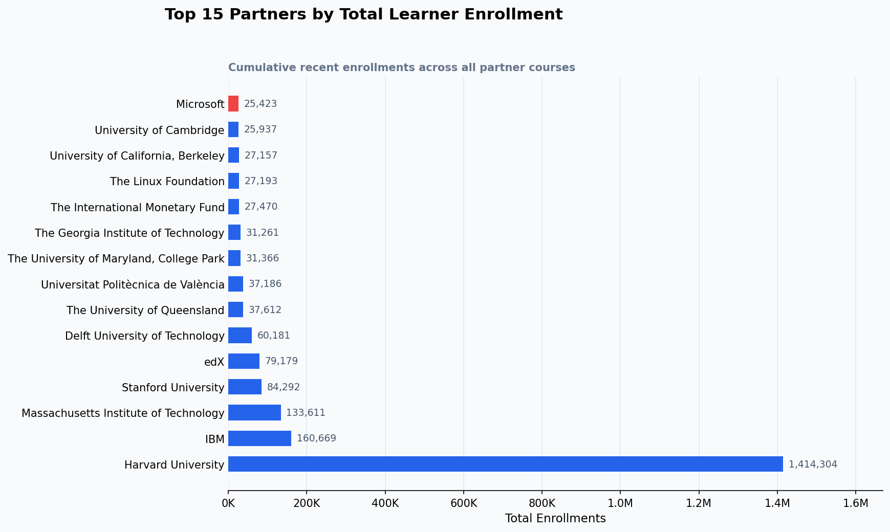

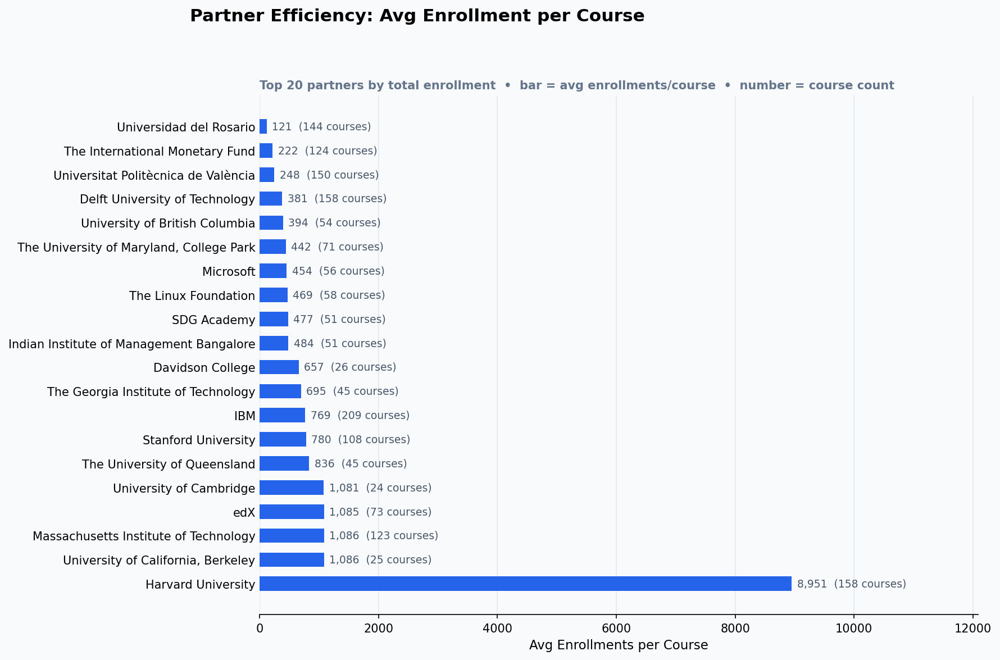

**What the charts show:**
Harvard University accounts for **1.41 million enrollments** out of a platform total of 3.02 million — nearly **47%** — from just 158 courses. Its average enrollment per course is **8,951**, more than **8× the platform average** of ~1,089 among the top 20 partners.

The next highest partners — MIT (1,086 avg), UC Berkeley (1,086 avg), Cambridge (1,080 avg) — are strong but operate at roughly one-eighth of Harvard's pull. IBM, despite running the largest course catalog of any single partner (209 courses), averages only 768 enrollments per course.

**Why it matters:**
The platform's headline enrollment metrics are disproportionately dependent on a single institution. If Harvard were to reduce its presence, shift to a competing platform, or re-negotiate its terms, total platform enrollment would fall precipitously. Additionally, large-catalog partners like IBM, Delft University (158 courses, 380 avg), and IMF (124 courses, 221 avg) generate significant content costs while delivering below-average learner returns.

**Recommended action:**
- Develop contingency plans and diversify by actively recruiting high-brand institutions (Oxford, Caltech, national technical universities).
- Introduce performance-based content agreements for high-volume, low-engagement partners to reduce catalog bloat.
- Investigate what makes Harvard courses outperform and replicate those content or marketing practices with emerging partners.

---

## Finding 3 — Advanced Learners Are an Under-Served, High-Value Segment

> **Chart:** `05_level_supply_vs_demand.png` · `08_subject_level_stack.png`

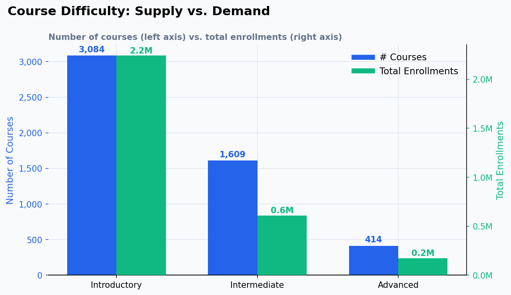

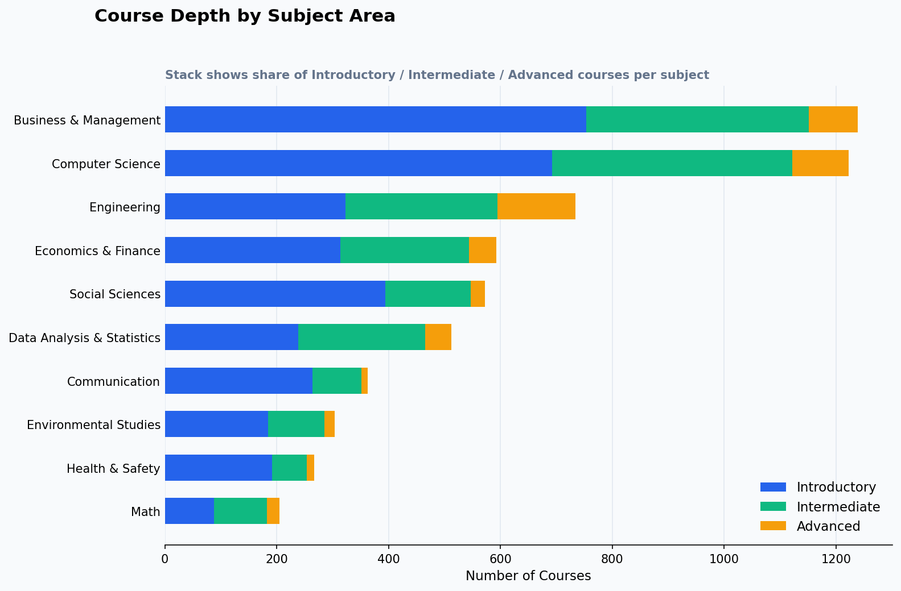

**What the charts show:**
**60% of courses are Introductory**, capturing 74% of all enrollments. Advanced courses make up only **8% of the catalog** (414 courses). Yet despite this scarcity, Advanced courses average **415 enrollments per course** — nearly the same as Intermediate (378) — suggesting they perform well when they exist.

The subject-level stacking chart shows this problem is systemic: every major subject — including Engineering, Data Analysis, and Computer Science — is bottom-heavy with introductory content. Engineering comes closest to balance, with a healthy share of intermediate and advanced courses. Social Sciences and Communication are almost entirely introductory.

**Why it matters:**
Introductory content is a gateway, not a destination. A learner who completes an introductory course and finds no continuation path on edX will seek advancement elsewhere — permanently. The platform risks acting as a top-of-funnel for other providers. Advanced content also commands higher price points and attracts professional learners with greater purchasing power.

**Recommended action:**
Build explicit "learning pathways" where introductory courses link forward to intermediate and advanced content. Set partner intake targets that require intermediate and advanced courses as a condition for publishing new introductory content.

---

## Finding 4 — Self-Paced Courses Consistently Outperform Instructor-Paced

> **Chart:** `06_self_paced_vs_instructor.png`

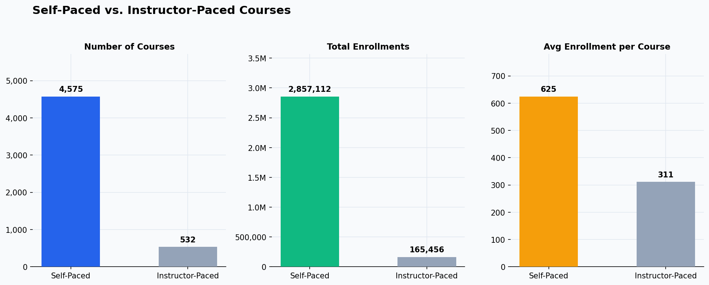

**What the charts show:**
Self-paced courses represent **90% of the catalog** (4,575 courses) and generate an average of **624 enrollments per course**. Instructor-paced courses average only **311 enrollments per course** — less than half. In total enrollment, self-paced courses account for **94.5%** of all platform activity.

**Why it matters:**
Instructor-paced courses impose fixed start dates and scheduled commitments — creating a higher friction barrier for the working professionals and casual learners who make up most of the edX audience. The data strongly suggests that format flexibility is a primary driver of learner adoption, not a secondary consideration.

**Recommended action:**
Offer partners conversion support to move instructor-paced content to a self-paced model. For courses that must remain instructor-paced (e.g., cohort-based programs), consider reducing their visibility in default search results and repositioning them as premium or professional offerings with targeted marketing, rather than competing directly in the general catalog.

---

## Finding 5 — The Sweet Spot: 3–6 Week Courses

> **Chart:** `07_duration_distribution.png`

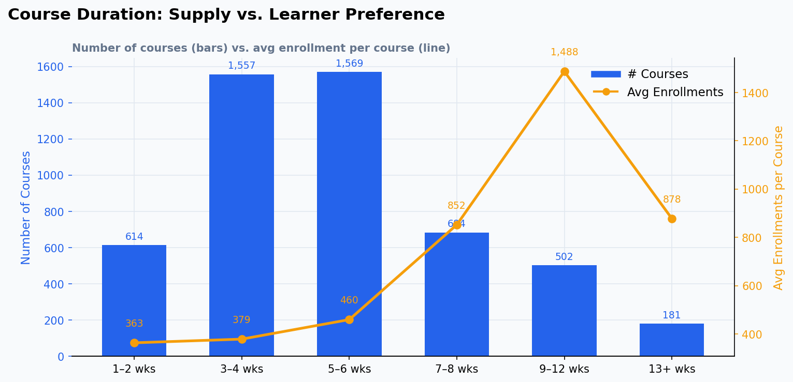

**What the charts show:**
Courses lasting **3–6 weeks** represent the largest portion of the catalog (3,126 courses combined) and demonstrate strong engagement. The average enrollment line peaks sharply at **1–2 week courses** (avg 874 enrollments) — driven by high-profile short content — then remains healthy in the 3–6 week window.

Courses longer than 8 weeks see a consistent decline in average enrollment: the 9–12 week bracket averages 368, and 13+ week courses drop to 244. Very short courses (1–2 weeks) are relatively rare (614 courses) but punch well above their weight in enrollments.

**Why it matters:**
Learners self-select into content that fits their available time. Content that exceeds 8 weeks either deters enrollment or suffers from drop-off. Partners and curriculum designers should treat 4–6 weeks as the standard target length for maximum reach.

**Recommended action:**
Advise partners to redesign long-format courses into shorter, modular units — e.g., a 16-week course becomes a 3-part series of 5-week courses. This also increases catalog breadth and creates natural upsell points within a subject.

---

## Finding 6 — The Skill Economy Signals: AI and Data Are Not Optional

> **Chart:** `09_top_skills.png`

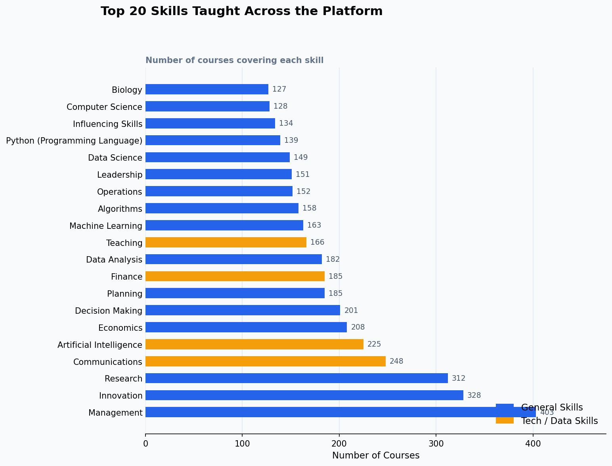

**What the charts show:**
The most frequently taught skills reflect a platform leaning toward management and professional development: Management (403 courses), Innovation (328), Research (312), Communications (248). However, **Artificial Intelligence (225 courses), Machine Learning (163), and Python (139)** rank within the top 15 — and these are the fastest-growing skill categories globally.

Given that Data Analysis & Statistics already leads in average enrollment per course (Finding 1), the presence of AI/ML/Python in the top skill list — despite having fewer courses — suggests unmet demand.

**Why it matters:**
The platform reflects where content production has traditionally been strong (business, soft skills), rather than where learner demand is headed (technical, AI-driven skills). The gap between supply and demand in AI/ML is a concrete revenue opportunity.

**Recommended action:**
Fast-track partnerships with AI-native companies (tech firms, research labs) to grow the AI and data science catalog. Create a featured AI & Data learning hub on the platform to capture organic search traffic and differentiate from competitors.

---

## Finding 7 — Non-English Markets Are Structurally Underperforming

> **Chart:** `11_language_supply_vs_demand.png`

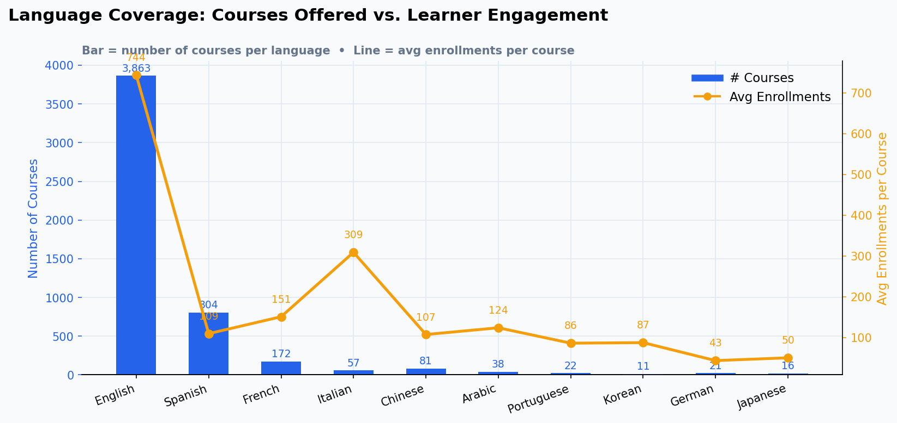

**What the charts show:**
English courses average **743 enrollments per course**, reinforcing their dominant position. **Italian courses average 308** — the highest average outside English — despite having only 57 courses. Spanish, despite being the second-largest language by course volume (804 courses), averages just **109 enrollments per course**, suggesting content quality or discoverability issues.

French (150 avg), Chinese (106), and Arabic (123) are well below English despite representing massive global addressable markets.

**Why it matters:**
Spanish has the supply but not the performance. This could reflect poor localization quality, lack of local institutional partnerships, or insufficient regional marketing investment. Italian's strong performance with a small catalog suggests high-quality content can succeed in non-English markets when done correctly.

**Recommended action:**
Audit Spanish-language content quality and partner credentials. Replicate what is working in the Italian catalog to other languages. Develop a non-English market growth strategy — particularly for Arabic and Portuguese, which are significantly underdeveloped relative to their global speaker populations.

---

## Finding 8 — Upcoming Courses Generate More Pre-Launch Demand Than Active Courses

> **Chart:** `12_availability_status.png`

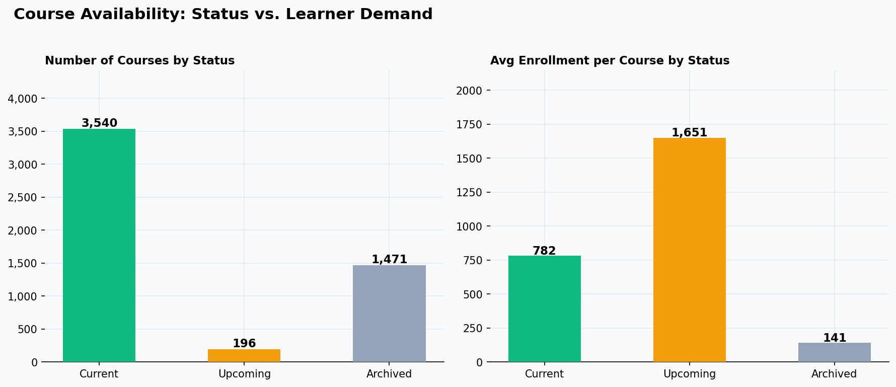

**What the charts show:**
**Upcoming courses** (196 courses, not yet launched) average **1,651 enrollments** — more than double the average for currently active courses (781) and more than 10× the average for archived courses (140). This is a striking pre-launch signal.

**Why it matters:**
The enrollment pipeline for upcoming courses is exceptionally strong, suggesting that learners actively watch for and pre-register for new content. This is a marketing and revenue moment that the platform may not be fully exploiting. Pre-launch registrations could be converted into immediate revenue (paid access, certification bundles) or used as demand signals to prioritize partner content.

**Recommended action:**
Build a formal "Coming Soon" feature prominently in the platform UI. Use pre-registration data to forecast revenue from upcoming launches and to determine which subjects need more upcoming content in the pipeline.

---

## Finding 9 — 60% of Courses Have Almost No Learners

> **Chart:** `13_enrollment_distribution.png` · `10_enrollment_concentration.png`

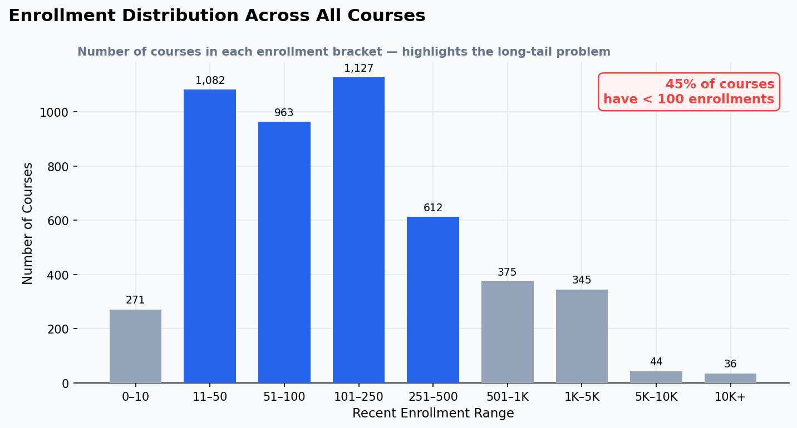

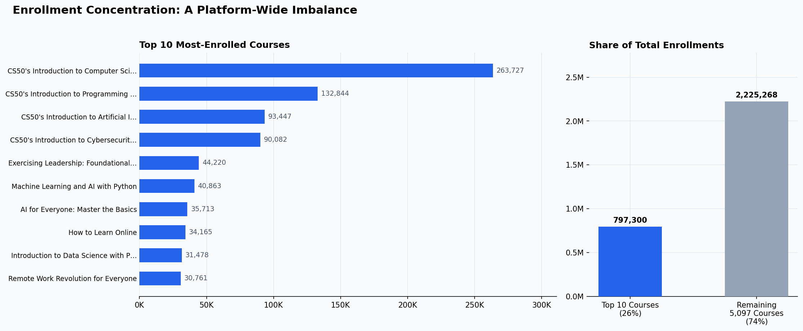

**What the charts show:**
The enrollment distribution is severely right-skewed. **60% of courses have fewer than 100 enrollments**, with 71 courses having zero enrollments. Meanwhile, the **top 10 courses** (0.2% of the catalog) capture **26% of all platform enrollments**. Harvard's CS50 alone has 263,727 enrollments.

The median enrollment across all courses is just **99** — meaning half the catalog has fewer than 100 learners. This is the classic long-tail problem at industrial scale.

**Why it matters:**
A catalog of 5,100 courses is only valuable if learners can find and engage with quality content. Low-enrollment courses consume maintenance, hosting, and support costs while contributing minimally to platform revenue or learner outcomes. The platform is simultaneously over-stocked in low-performing content and under-stocked in high-performing categories.

**Recommended action:**
- Implement a **performance review threshold**: courses with fewer than 50 enrollments after 12 months should be reviewed for retirement, refresh, or promotion support.
- Invest in algorithmic discovery improvements (search, recommendations) to reduce the winner-takes-all dynamic and surface quality long-tail content.
- Report partner-level performance dashboards so institutions can self-identify and improve or retire underperforming courses.

---

## Summary of Strategic Actions

| Priority | Action | Insight |
|---|---|---|
| 🔴 High | Reduce platform dependency on Harvard; recruit new elite institutional partners | Finding 2 |
| 🔴 High | Grow Data Analysis & AI course supply to match demonstrated demand | Findings 1, 6 |
| 🔴 High | Implement course retirement policy for sub-50 enrollment courses | Finding 9 |
| 🟡 Medium | Convert long-format courses (8+ weeks) to modular series | Finding 5 |
| 🟡 Medium | Build intermediate and advanced pathways to retain advancing learners | Finding 3 |
| 🟡 Medium | Migrate or incentivize instructor-paced courses to self-paced format | Finding 4 |
| 🟡 Medium | Invest in non-English content quality audit, especially Spanish | Finding 7 |
| 🟢 Standard | Launch "Coming Soon" pre-registration feature to capitalize on upcoming demand | Finding 8 |

---

*Report generated from 5,107 courses scraped from the edX public catalog. All enrollment figures represent recent activity as reported by the platform.*
